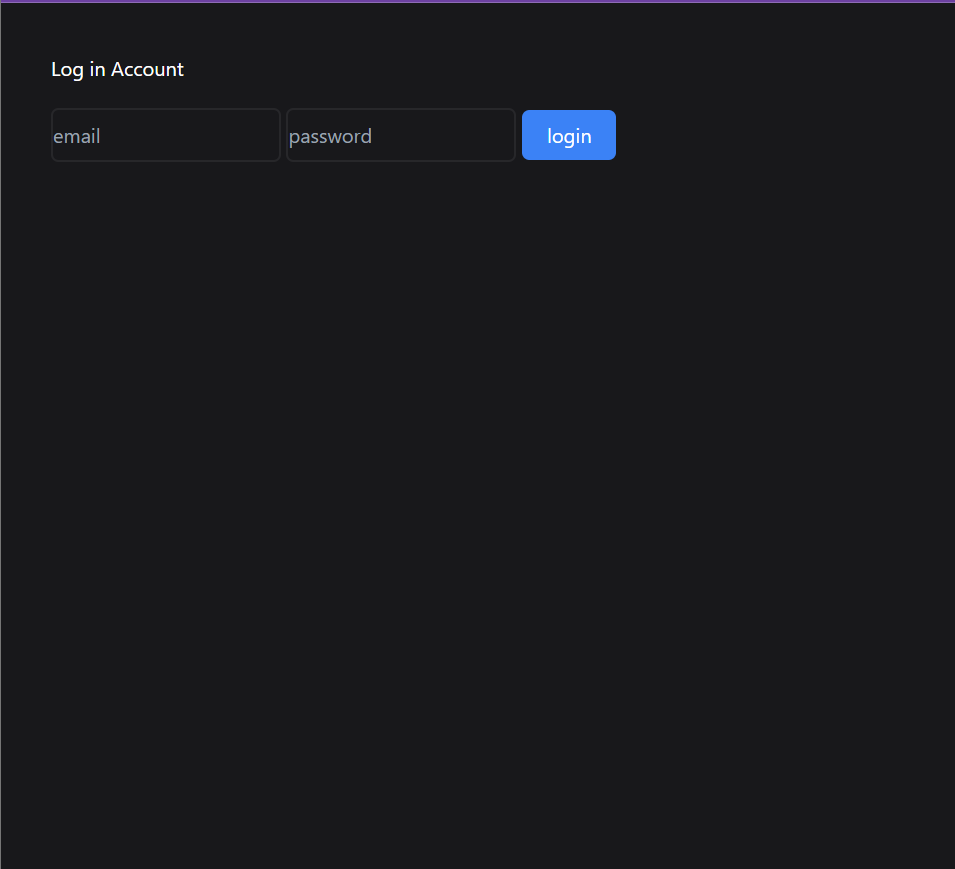
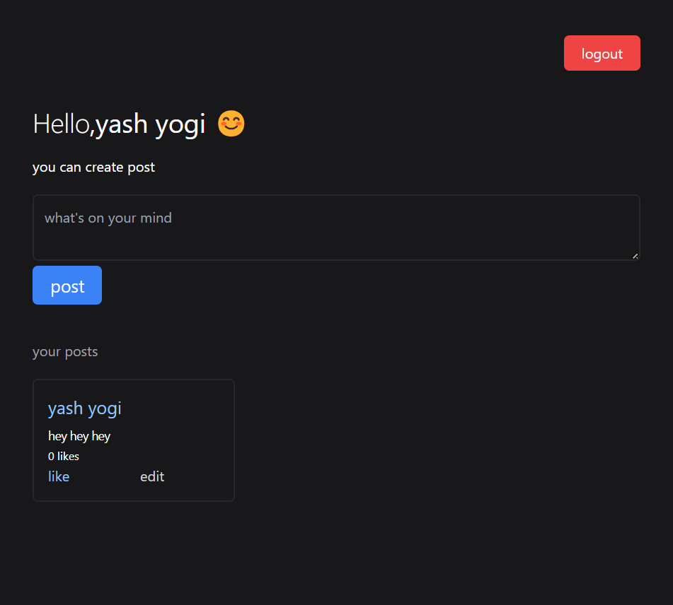
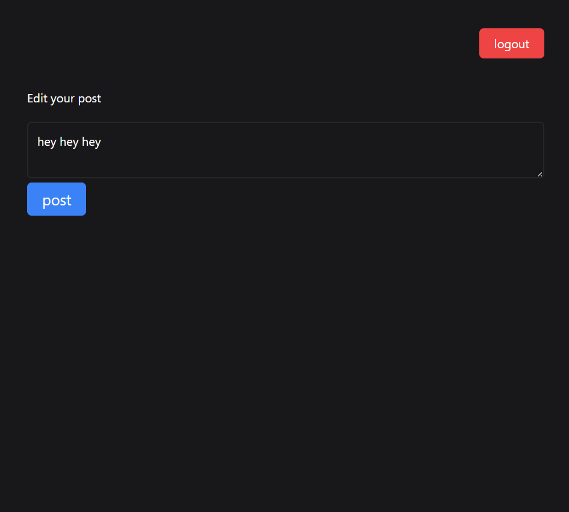

# Mini Blog Project

This is a simple blog project that allows users to create an account, log in and create posts. The posts are displayed on the dashboard page.

## Features

* User registration and login
* Post creation and display on the dashboard page
* Like and unlike posts

## Technologies Used

* Node.js
* Express.js
* Mongoose
* EJS
* Tailwind CSS

## Installation

1. Clone the repository
2. Install the dependencies by running `npm install`
3. Start the server by running `node app.js`
4. Open a web browser and navigate to `http://localhost:3000`

## Screenshots

